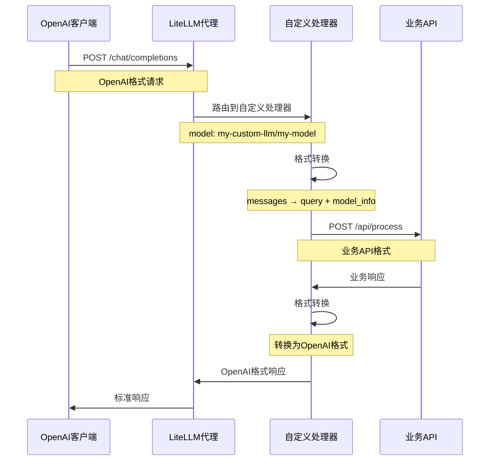

# LiteLLM 自定义适配器

## 📋 项目概述

本项目实现了一个基于 LiteLLM 的自定义适配器，用于将 OpenAI 格式的 API 请求转换为自定义业务 API 格式，实现无缝的 API 集成。

### 🏗️ 系统架构

```
OpenAI客户端 → LiteLLM代理 → 自定义处理器 → 业务API
    (8080)      (my-custom-llm)    (8002)
```

### ✨ 主要特性

- ✅ **OpenAI兼容**：提供完全兼容的OpenAI API接口
- ✅ **格式转换**：自动转换请求/响应格式
- ✅ **错误处理**：完善的错误处理和降级策略
- ✅ **配置驱动**：灵活的配置文件管理
- ✅ **日志监控**：详细的日志记录和调试信息
- ✅ **热重载**：支持配置文件热重载
- ✅ **健康检查**：完整的服务健康检查机制

## 🚀 快速开始

### 1. 环境准备

```bash
# 克隆项目
git clone <repository-url>
cd trae-litellm

# 安装依赖
pip install -r requirements.txt
```

### 2. 配置环境

```bash
# 复制环境变量模板
cp src/.env.example src/.env

# 编辑环境变量
vim src/.env
```

### 3. 启动服务

```bash
# 方式1：使用启动脚本（推荐）
./start_services.sh

# 方式2：手动启动
# 启动业务API
python src/liteLLMAdapter/business_api_example.py --env-file src/.env --port 8002 --host 0.0.0.0 &

# 启动LiteLLM代理
cd src && litellm --config config.yaml --host 0.0.0.0 --port 8080 &
```

### 4. 验证系统

```bash
# 运行验证脚本
./verify_system.sh

# 手动测试
curl -X POST http://localhost:8080/chat/completions \
  -H "Content-Type: application/json" \
  -d '{
    "model": "my-custom-model",
    "messages": [{"role": "user", "content": "Hello"}],
    "max_tokens": 100
  }'
```

## 📚 文档

| 文档 | 描述 |
|------|------|
| [STARTUP_GUIDE.md](STARTUP_GUIDE.md) | 详细的启动流程指南 |
| [CONFIGURATION_GUIDE.md](CONFIGURATION_GUIDE.md) | 配置说明和最佳实践 |
| [DEPRECATED.md](DEPRECATED.md) | 废弃文件说明 |
| [src/liteLLMAdapter/README.md](src/liteLLMAdapter/README.md) | 适配器详细文档 |

## 🔧 核心组件

### 业务API (`business_api_example.py`)
- 模拟自定义业务逻辑的API服务
- 接受特定格式的请求：`query`, `model_info`
- 返回结构化响应

### LiteLLM代理
- 提供OpenAI兼容的API接口
- 处理模型路由和请求分发
- 支持多种LLM提供商

### 自定义处理器 (`custom_handler.py`)
- 实现请求格式转换
- 调用业务API
- 处理响应格式转换

### 配置文件 (`config.yaml`)
- 模型定义和映射
- 自定义处理器注册
- 服务器配置

## 🔄 请求流程



## 📊 API 端点

### LiteLLM代理 (端口8080)

| 端点 | 方法 | 描述 |
|------|------|------|
| `/health` | GET | 健康检查 |
| `/chat/completions` | POST | 聊天完成接口 |
| `/models` | GET | 可用模型列表 |

### 业务API (端口8002)

| 端点 | 方法 | 描述 |
|------|------|------|
| `/health` | GET | 健康检查 |
| `/api/process` | POST | 业务处理接口 |

## 🛠️ 开发工具

### 验证脚本
```bash
./verify_system.sh    # 完整系统验证
```

### 服务管理
```bash
./start_services.sh   # 启动所有服务
./stop_services.sh    # 停止所有服务
```

### 日志查看
```bash
# 查看业务API日志
tail -f src/logs/business_api_*.log

# 查看LiteLLM代理日志
tail -f src/logs/litellm_proxy_*.log
```

## 🔍 故障排除

### 常见问题

1. **连接被拒绝**
   ```bash
   # 检查服务是否启动
   netstat -tlnp | grep -E "(8002|8080)"
   ```

2. **配置错误**
   ```bash
   # 验证配置文件格式
   python -c "import yaml; print(yaml.safe_load(open('src/config.yaml')))"
   ```

3. **模块导入失败**
   ```bash
   # 测试自定义处理器导入
   cd src && python -c "from custom_handler import my_custom_llm; print('✓ 导入成功')"
   ```

### 调试模式

```bash
# 启用详细日志
echo "LOG_LEVEL=DEBUG" >> src/.env

# 重启服务
./stop_services.sh && ./start_services.sh
```

## 🚀 生产部署

### Docker部署

```dockerfile
FROM python:3.9-slim

WORKDIR /app
COPY . .

RUN pip install -r requirements.txt

EXPOSE 8080 8002

CMD ["./start_services.sh"]
```

### 环境变量

生产环境建议配置：

```env
# 生产配置
LOG_LEVEL=INFO
BUSINESS_API_HOST=0.0.0.0
BUSINESS_API_PORT=8002
LITELLM_PROXY_HOST=0.0.0.0
LITELLM_PROXY_PORT=8080

# 安全配置
BUSINESS_API_KEY=your-production-key
```

## 🤝 贡献指南

1. Fork 项目
2. 创建功能分支 (`git checkout -b feature/AmazingFeature`)
3. 提交更改 (`git commit -m 'Add some AmazingFeature'`)
4. 推送到分支 (`git push origin feature/AmazingFeature`)
5. 打开 Pull Request

## 📄 许可证

本项目采用 MIT 许可证 - 查看 [LICENSE](LICENSE) 文件了解详情。

## 📞 支持

如果您遇到问题或有疑问：

1. 查看 [故障排除](#-故障排除) 部分
2. 运行 `./verify_system.sh` 检查系统状态
3. 查看相关文档
4. 提交 Issue

## 📈 项目状态

- ✅ 核心功能完成
- ✅ 完整测试验证
- ✅ 文档完善
- ✅ 生产就绪

**最后更新**: 2025-01-05 